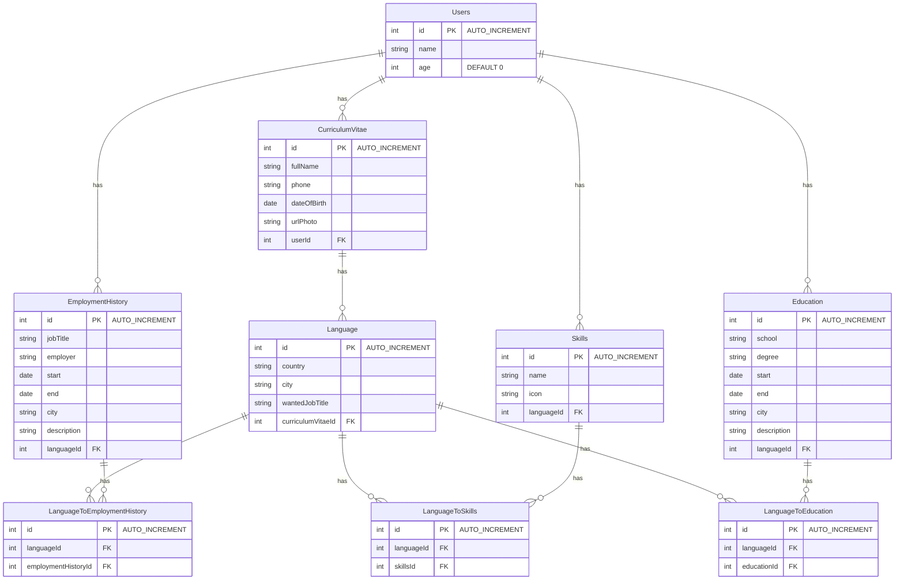

```mermaid
erDiagram
    Users {
      int id PK "AUTO_INCREMENT"
      
      string name
      int age "DEFAULT 0"
    }
    
    CurriculumVitae {
      int id PK "AUTO_INCREMENT"
      
      string fullName
      string phone
      date   dateOfBirth
      string urlPhoto
      
      int userId FK
    }
    
    Language {
      int id PK "AUTO_INCREMENT"
      
      string country
      string city
      string wantedJobTitle
      
      int curriculumVitaeId FK
    }
    
    EmploymentHistory {
      int id PK "AUTO_INCREMENT"
      
      string jobTitle
      string employer
      date   start
      date   end
      string city
      string description
      
      int languageId FK
    }
    
    Skills {
      int id PK "AUTO_INCREMENT"
      
      string name
      string icon
      
      int languageId FK
    }
    
    Education {
      int id PK "AUTO_INCREMENT"
      
      string school
      string degree
      date   start
      date   end
      string city
      string description
      
      int languageId FK
    }
    
    LanguageToEmploymentHistory {
      int id PK "AUTO_INCREMENT"
      
      int languageId          FK
      int employmentHistoryId FK
    }
    
    LanguageToSkills {
      int id PK "AUTO_INCREMENT"
      
      int languageId FK
      int skillsId   FK
    }
    
    LanguageToEducation {
      int id PK "AUTO_INCREMENT"
      
      int languageId  FK
      int educationId FK
    }
    
    Users ||--o{ CurriculumVitae: "has"
    Users ||--o{ EmploymentHistory: "has"
    Users ||--o{ Skills: "has"
    Users ||--o{ Education: "has"
    
    CurriculumVitae ||--o{ Language: "has"
    
    Language          ||--o{ LanguageToEmploymentHistory: "has"
    EmploymentHistory ||--o{ LanguageToEmploymentHistory: "has"
    
    Language ||--o{ LanguageToSkills: "has"
    Skills   ||--o{ LanguageToSkills: "has"
    
    Language  ||--o{ LanguageToEducation: "has"
    Education ||--o{ LanguageToEducation: "has"
```
