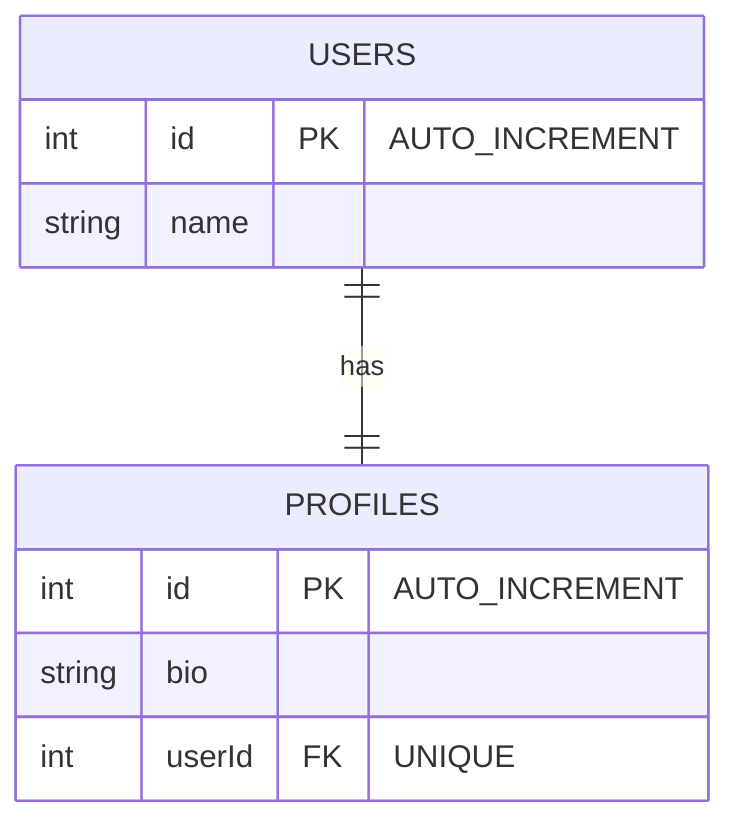
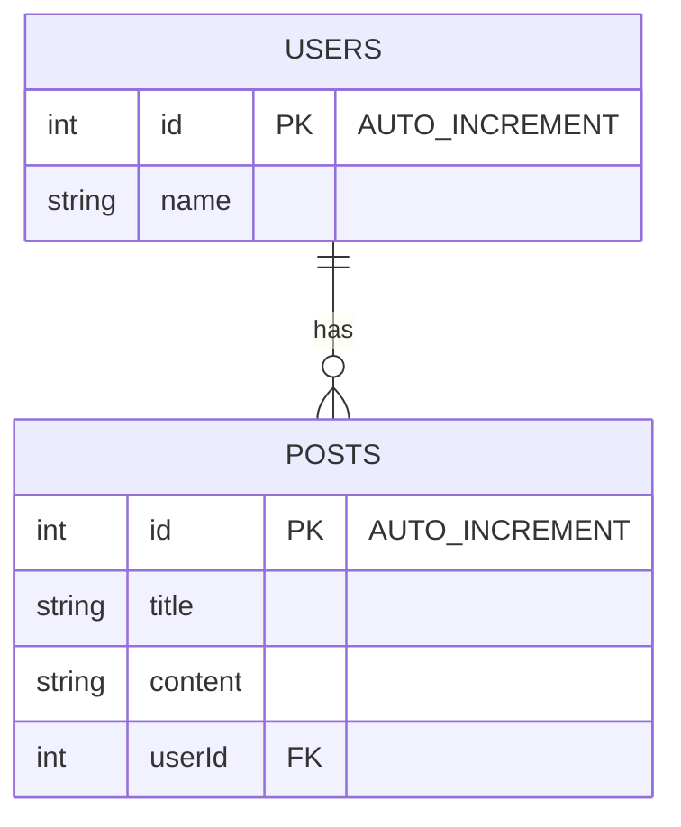
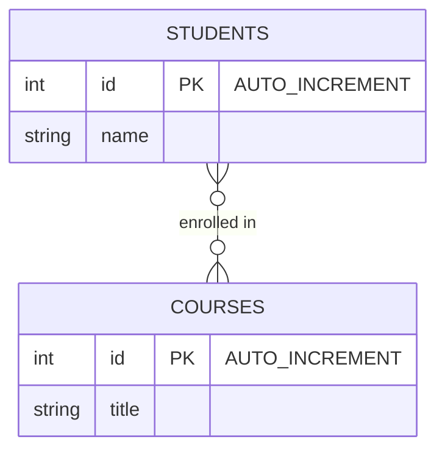

#### Um para Um (One-to-One)

**Mermaid ER Diagram:**

USERS ||--|| PROFILES: "has"

#### Um para Muitos (One-to-Many)

**Mermaid ER Diagram:**

USERS ||--o{ POSTS: "has"

#### Muitos para Muitos (Many-to-Many)

**Mermaid ER Diagram:**

STUDENTS }o--o{ COURSES: "enrolled in"

### Resumo

- **Um para Um (One-to-One)**: Cada usuário tem um perfil, e cada perfil pertence a um usuário.
- **Um para Muitos (One-to-Many)**: Um usuário pode ter muitos posts, e cada post pertence a um usuário.
- **Muitos para Muitos (Many-to-Many)**: Um estudante pode estar matriculado em muitos cursos, e um curso pode ter muitos estudantes.
