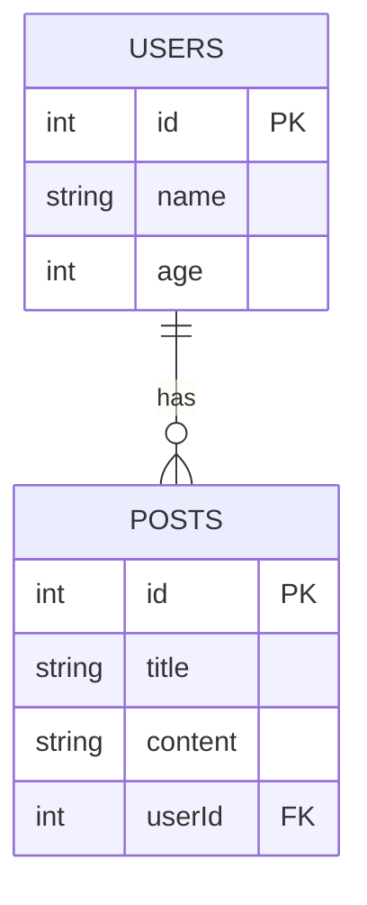
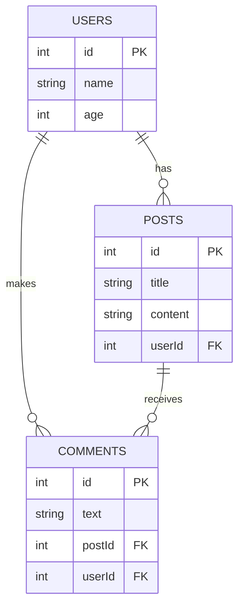

### Tabela: Users
- **id**: number (Primary Key, Auto Increment)
- **name**: string

### Tabela: CurriculumVitae
- **name**: string
- **name**: string
- **name**: string
- **name**: string
- **name**: string
- **name**: string
- **name**: string
- **name**: string
- **name**: string
- **name**: string

### Tabela: CurriculumVitae
- **name**: string
- **name**: string
- **name**: string
- **name**: string
- **name**: string
- **name**: string
- **name**: string
- **name**: string
- **name**: string
- **name**: string

### Tabela: CurriculumVitae
- **name**: string
- **name**: string
- **name**: string
- **name**: string
- **name**: string
- **name**: string
- **name**: string
- **name**: string
- **name**: string
- **name**: string

### Tabela: CurriculumVitae
- **name**: string
- **name**: string
- **name**: string
- **name**: string
- **name**: string
- **name**: string
- **name**: string
- **name**: string
- **name**: string
- **name**: string

### Tabela: Posts
- **id**: number (Primary Key, Auto Increment)
- **title**: string
- **content**: string
- **userId**: number (Foreign Key referencing Users)

### Relações:
- Um usuário pode ter muitos posts (One-to-Many: Users -> Posts)
- Um post pertence a um usuário (Many-to-One: Posts -> Users)


Para criar diagramas de entidades e relacionamentos (ERD) utilizando o Mermaid no Markdown, você pode usar a sintaxe `erDiagram`. Aqui está um exemplo de como você pode desenhar a base de dados com Mermaid:

### Exemplo de Diagrama ERD com Mermaid



### Como Construir um Diagrama ERD

Você pode descrever a estrutura do seu banco de dados desta maneira. Vamos considerar um exemplo mais complexo com várias tabelas e relações.

### Descrição do Banco de Dados

#### Tabela: USERS
- **id**: number (Primary Key, Auto Increment)
- **name**: string
- **age**: number

#### Tabela: POSTS
- **id**: number (Primary Key, Auto Increment)
- **title**: string
- **content**: string
- **userId**: number (Foreign Key referencing USERS)

#### Tabela: COMMENTS
- **id**: number (Primary Key, Auto Increment)
- **text**: string
- **postId**: number (Foreign Key referencing POSTS)
- **userId**: number (Foreign Key referencing USERS)

#### Relações:
- Um usuário pode ter muitos posts (One-to-Many: USERS -> POSTS)
- Um post pertence a um usuário (Many-to-One: POSTS -> USERS)
- Um post pode ter muitos comentários (One-to-Many: POSTS -> COMMENTS)
- Um comentário pertence a um post (Many-to-One: COMMENTS -> POSTS)
- Um usuário pode fazer muitos comentários (One-to-Many: USERS -> COMMENTS)
- Um comentário pertence a um usuário (Many-to-One: COMMENTS -> USERS)

### Diagrama ERD com Mermaid



### Criação das Entidades no TypeORM

Com base nesse diagrama, aqui estão as entidades do TypeORM:

#### User Entity

```typescript
import { Entity, Column, PrimaryGeneratedColumn, OneToMany } from 'typeorm';
import { Post } from './post.entity';
import { Comment } from './comment.entity';

@Entity()
export class User {
  @PrimaryGeneratedColumn()
  id: number;

  @Column()
  name: string;

  @Column()
  age: number;

  @OneToMany(() => Post, post => post.user)
  posts: Post[];

  @OneToMany(() => Comment, comment => comment.user)
  comments: Comment[];
}
```

#### Post Entity

```typescript
import { Entity, Column, PrimaryGeneratedColumn, ManyToOne, OneToMany } from 'typeorm';
import { User } from './user.entity';
import { Comment } from './comment.entity';

@Entity()
export class Post {
  @PrimaryGeneratedColumn()
  id: number;

  @Column()
  title: string;

  @Column()
  content: string;

  @ManyToOne(() => User, user => user.posts)
  user: User;

  @OneToMany(() => Comment, comment => comment.post)
  comments: Comment[];
}
```

#### Comment Entity

```typescript
import { Entity, Column, PrimaryGeneratedColumn, ManyToOne } from 'typeorm';
import { Post } from './post.entity';
import { User } from './user.entity';

@Entity()
export class Comment {
  @PrimaryGeneratedColumn()
  id: number;

  @Column()
  text: string;

  @ManyToOne(() => Post, post => post.comments)
  post: Post;

  @ManyToOne(() => User, user => user.comments)
  user: User;
}
```

Esses exemplos devem cobrir a estrutura básica de um sistema de blog com usuários, posts e comentários. Se você tiver mais tabelas ou relacionamentos específicos, sinta-se à vontade para descrevê-los, e eu posso ajudar a criar as entidades correspondentes.
